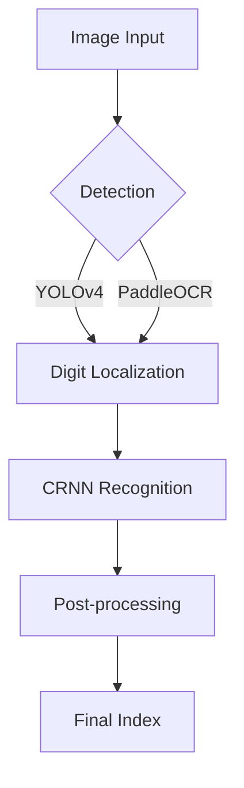

<p align="center">
    <a href="./LICENSE"></a>
    <a href=""></a>
    <a href=""></a>
</p>

<!-- <a href="https://github.com/ChristopheVuong/AI-meter-reading/actions"></a> -->

# 🚰 AI Meter Reading

## 📝 Context
SUEZ needs to automatically read water meter indices from images to:
- Reduce manual meter readings
- Eliminate client coordination for property access
- Provide instant feedback on image quality

This project creates an ML pipeline to extract consumption indices from meter images with:
- Heterogeneous image quality handling
- Support for rotated meters
- Digit recognition from analog wheels (5 m³ digits + 3 liter digits)

## 🚀 Getting Started

### 1. Clone Repository
```bash
git clone git@github.com:ChristopheVuong/AI-meter-reading.git
cd AI-meter-reading
```

### 2. Setup Environment
```bash
# Install dependencies with Poetry
poetry install

# Activate virtual environment
poetry shell
```

### 3. Data Access
1. Request dataset access:  
   christophe.vuong108@gmail.com
2. Dataset features:  
   - 1,000+ annotated RGB meter images
   - Mixed quality (underground meter locations)
   - Various meter orientations
   - Human-verified indices (cubic meters truncated)

## 🤖 ML Pipeline

### Architecture



### Model Options
| Framework       | Detection | Recognition | Commercial Use |
|-----------------|-----------|-------------|----------------|
| YOLOv4          | ✔️        | CRNN        | Requires license |
| PaddleOCRv3     | ✔️        | ✔️          | Apache 2.0     |
| Vision Transformers | ✔️    | ✔️          | MIT            |

<!-- ### Training
```bash
# PaddleOCR example
poetry run python train.py \
    --model PP-OCRv3 \
    --data_dir ./data/processed \
    --epochs 100 \
    --batch_size 16
``` -->

## 📦 Project Structure
```
.
├── data/               # Processed datasets
├── models/             # Trained model checkpoints
├── notebooks/          # Experimentation & analysis
├── src/                # Source code (PaddleOCR, YOLO, perhaps Qwen2VL)
└── tests/              # Unit tests
```

## 📊 Evaluation Metrics
- Detection mAP: >80%
- Digit recognition accuracy: >85%
- End-to-end index accuracy: >80%

## 🛠️ Development

UNDER COURSE

<!-- ### Preprocessing Tools

```python
# Example: Image augmentation
from src.preprocessing import augment_meter_image

augmented = augment_meter_image(
    image,
    rotate_range=15,
    brightness_range=(0.8, 1.2),
    add_noise=True
)
``` -->

<!-- ### CI/CD Pipeline

(SOMETHING LIKE)
```yaml
# .github/workflows/ci.yml
name: ML Pipeline
on: [push, pull_request]
jobs:
  test:
    runs-on: ubuntu-latest
    steps:
      - uses: actions/checkout@v3
      - name: Test suite
        run: poetry run pytest tests/
  deploy:
    needs: test
    runs-on: ubuntu-latest
    steps:
      - name: Deploy model
        run: |
          poetry run python deploy.py \
            --model ./models/best_ckpt.pth \
            --target s3://suez-models
``` -->

<!-- ## 🤝 Contributing
1. Fork repository
2. Create feature branch
3. Submit pull request
4. Sign CLA if prompted -->

## 📄 License
Apache 2.0 License - see [LICENSE](LICENSE) for details

## 📧 Contact
Christophe Vuong - christophe.vuong108@gmail.com  
SUEZ Innovation Team - innovation@suez.com